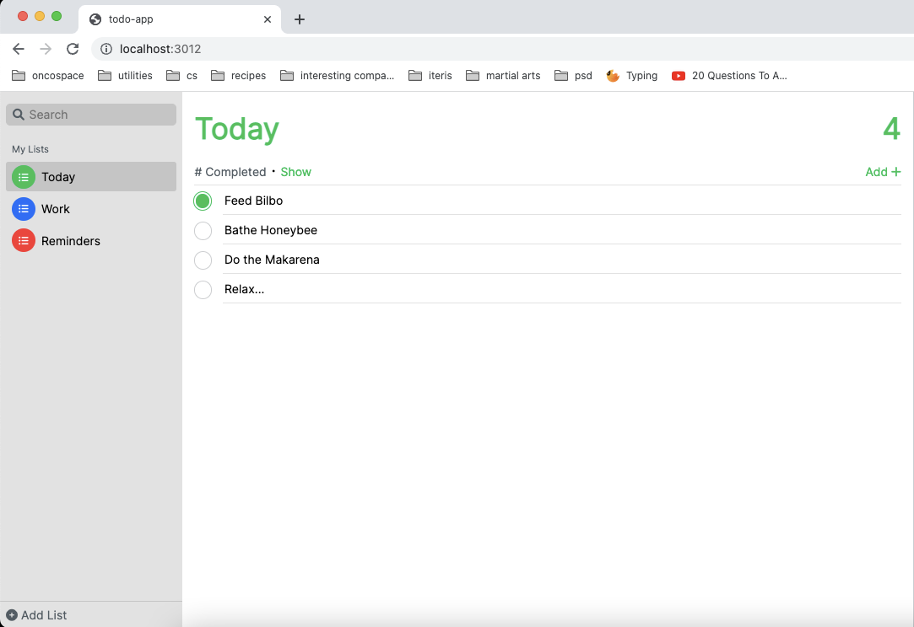

# Loki.js

A humble library for building SPAs that lets you

1. Create well-defined interfaces for your components
2. Automatically instantiate child components from a parent
3. Put your html, css and js all in one place
4. Define events for your loki components
5. Build and serve with a cli

## Features

### Get started easily with the loki CLI

Create a new directory for your project, and then create a npm package.

```bash
npm init
```

Install loki

```bash
npm i @skapoor8/loki
```

To create a new loki project

```
npx loki new myApp
```

This will create a loki-js project with the following files:

1. loki.json - your project configuration
2. app.css - global styles for your app
3. index.html - the html file which your SPA will attach to
4. app.js - the Loki component that will bootstrap your app.

Your app will look like this:

```javascript
import Loki from "@skapoor8/loki";

class App extends Loki.Component {
  static selector = "loki-app";

  render() {
    return `
      <h1>Loki App</h1>
      <p>Welcome to your Loki app!</p>
    `;
  }
}

export default App;
```

Now you can serve your app:

```
npx loki build
npx loki serve
```

Your app should be live on localhost:3012

### Create components, and template with EJS (Embedded JavaScript)

Creating a component is as simple as adding a new file. In the render method, use [Embedded JavaScript (EJS)](https://ejs.co/) to embed variables, use if branches and for loops. Choose a component selector using the static selector property on your component.

```javascript
// src/example-component.js
import Loki from "@skapoor8/loki";

export class MyList extends Loki.Component {
  // define a component selector here
  static selector = "my-list";

  /*
   * A components template goes here. Attach event handlers as shown below
   * for the click event. The templating language is EJS.
   */
  render() {
    this.state = {
      list: [1, 2, 3],
    };
    return /* html */ `              
      <div >
        <h1>My List</h1>
        <ol>
        <% for (item of list) { %>
          <li><%= item %></li>
        <% } %>
        </ol>
      </div>
    `;
  }
}
```

Now you can register your new component in your app, and use its selector in your app component's template.

```javascript
// src/app.js
import Loki from "@skapoor8/loki";
import { ExampleComponent } from "./example-component";

class App extends Loki.Component {
  static selector = "loki-app";
  static components = [ExampleComponent];

  render() {
    return `
          <my-list></my-list>
        `;
  }
}

export default App;
```

### Use fast-refresh in development

Any changes in your components should be reflected immediately in the browser while in development. This behavior is controlled by the "mode" property in your loki.json file, which is set to "local" by default.

### Add event handlers

Listen to events in the DOM with event handlers. Pass data through dataset attributes.

```javascript
...

export class MyList extends Loki.Component {
  static selector = "my-list";

  render() {
    this.state = {
      list: [1, 2, 3],
    };
    return /* html */ `
      <div  (click)="handleClick" data-list="<%= list %>">
        <h1>My List</h1>
        <ol>
        <% for (item of list) { %>
          <li><%= item %></li>
        <% } %>
        </ol>
      </div>
    `;
  }

  handleClick(e) {
    console.log('click:', e.target.dataset.list);
  }

}
```

### Hook into your component's lifeycycle

Lifecycle methods onBeforeInit, onInit, onBeforeDestroy, onDestroy, and onUpdateState are provided to initialize component data, and register side-effects. For example, onBeforeInit is where initial state of a component should be set.

```javascript
...

export class MyList extends Loki.Component {
  static selector = "my-list";

  render() {
    return /* html */ `
      <div  (click)="handleClick" data-list="<%= list %>">
        <h1>My List</h1>
        <ol>
        <% for (item of list) { %>
          <li><%= item %></li>
        <% } %>
        </ol>
      </div>
    `;
  }

  onBeforeInit() {
     this.state = {
      list: [1, 2, 3],
    };
  }

  handleClick(e) {
    console.log('click:', e.target.dataset.list);
  }

}
```

### Update the UI by updating your component's state

Use the setState method to re-render your component with its updated state

```javascript
...

export class MyList extends Loki.Component {
  static selector = "my-list";

  render() {
    return /* html */ `
      <div >
        <h1>My List</h1>
        <ol>
        <% for (item of list) { %>
          <li><%= item %></li>
        <% } %>
        </ol>
        <button (click)="handleAdd">Add</button>
      </div>
    `;
  }

  onBeforeInit() {
     this.state = {
      list: [1, 2, 3],
    };
  }

  handleAdd() {
    this.setState({
      list: [...this.state.list, his.state.list.length + 1]
    });
  }

}
```

### Register child components, and use them in your templates

Use the components static property to register child components which will be used in your component's template. The state property can be used on all Loki components to initialize component states.

```javascript
export class MyList extends Loki.Component {
  static selector = "my-list";
  static components = [MyListItem];

  render() {
    return /* html */ `              
      <div >
        <h1>My List</h1>
        <% for (item of list) { %>
          <my-list-item state="<%= item %>"></my-list-item>
        <% } %>
        <button (click)="handleAdd">Add</button>
      </div>
    `;
  }

  onBeforeInit() {
    this.state = {
      list: [1, 2, 3],
    };
  }

  handleAdd() {
    this.setState({
      list: [...this.state.list, his.state.list.length + 1],
    });
  }
}

class MyListItem extends Loki.Component {
  static selector = "my-list-item";
  render() {
    return /* html */ `              
        <span><%= value %></span>
    `;
  }
}
```

### Custom events for components

You can create custom events in your components, and dispatch them with the emit method.

```javascript
export class MyList extends Loki.Component {
  static selector = "my-list";
  static components = [MyListItem];
  static events = ["add"];

  render() {
    return /* html */ `              
      <div >
        <h1>My List</h1>
        <% for (item of list) { %>
          <my-list-item state="<%= item %>"></my-list-item>
        <% } %>
        <button (click)="handleAdd">Add</button>
      </div>
    `;
  }

  onBeforeInit() {
    this.state = {
      list: [1, 2, 3],
    };
  }

  handleAdd() {
    const toAdd = this.state.list.length + 1;
    this.setState({
      list: [...this.state.list, toAdd],
    });
    this.emit("add", { added: toAdd });
  }
}

class MyListItem extends Loki.Component {
  static selector = "my-list-item";
  render() {
    return /* html */ `              
        <span><%= value %></span>
    `;
  }
}
```

### Add styles with css

Use the style static method to add styles to your component's template. All css will automatically be prefixed with your component's selector to scope the css properly.

```javascript
export class MyList extends Loki.Component {
  static selector = "my-list";
  static components = [MyListItem];
  static events = ["add"];

  static style() {
    return /* css */ `
      .container {
        width: 100%;
        display: flex;
        flex-direction: column;
        align-items: stretch;
      }

      h1 {
        border-bottom: thin solid gray;
      }
    `;
  }

  render() {
    return /* html */ `              
      <div class="container">
        <h1>My List</h1>
        <% for (item of list) { %>
          <my-list-item state="<%= item %>"></my-list-item>
        <% } %>
        <button (click)="handleAdd">Add</button>
      </div>
    `;
  }

  onBeforeInit() {
    this.state = {
      list: [1, 2, 3],
    };
  }

  handleAdd() {
    const toAdd = this.state.list.length + 1;
    this.setState({
      list: [...this.state.list, toAdd],
    });
    this.emit("add", { added: toAdd });
  }
}

class MyListItem extends Loki.Component {
  static selector = "my-list-item";
  render() {
    return /* html */ `              
        <span><%= value %></span>
    `;
  }
}
```

### Use dependency injection with services

Loki implements a simple DI system, whereby services that inherit from Loki.Service will be injected at the highest level in the component subtree from where they are first registered via the services static property on components.

Services implement lifecycle methods onLoad and onUnload to handle any data loading and cleanup. Services also provide a static services property to allow them to inject other services, or data stores.

For example, say we wish to put all our code the interacts with the api layer in a service. We can do so by creating a MyApiService class in our project. We may have a function loadList on this class to fetch our list from our api, instead of initiliazing it with meaningless values as we do now. We can now inject this service, and use it as follows:

```javascript
export class MyList extends Loki.Component {
  static selector = "my-list";
  static components = [MyListItem];
  static events = ["add"];
  static services = { api: MyApiService };

  static style() {
    return /* css */ `
      ...
    `;
  }

  render() {
    return /* html */ `              
      <div class="container">
        <h1>My List</h1>
        <% if (isLoading ) { %>
          <span>Loading...</span>
        <% } else { %>
          <% for (item of list) { %>
            <my-list-item state="<%= item %>"></my-list-item>
          <% } %>
          <button (click)="handleAdd">Add</button>
        <% } %>
      </div>
    `;
  }

  onBeforeInit() {
    this.state = {
      list: [],
      isLoading: true,
    };
  }

  // api call goes here
  onInit() {
    const { api } = this.services;
    api.loadList().then((data) =>
      this.setState({
        list: data,
        isLoading: false,
      })
    );
  }

  handleAdd() {
    const toAdd = this.state.list.length + 1;
    this.setState({
      list: [...this.state.list, toAdd],
    });
    this.emit("add", { added: toAdd });
  }
}

class MyListItem extends Loki.Component {
  static selector = "my-list-item";
  render() {
    return /* html */ `              
        <span><%= value %></span>
    `;
  }
}
```

### Program reactively with data stores

Using a 3rd party library is the recommended way of handling reactivity in a Loki App. However, a simple data store is provided as well. Create a data store as follows:

```javascript
import Loki from "loki";

export class UIStore extends Loki.Store {
  /*
   * Initialize the state of your store here
   */
  init() {
    this.payloads = {
      lists: [],
      isLoading: true,
    };
  }
}
```

To use a store, inject it in a component or a service. To publish values to a store property, use the pub api.

```javascript
myStore.pub("isLoading", false);
```

To react to updates in store properties, use the sub api.

```javascript
const sub = myStore.sub(
  "isLoading",
  (propVal) => {
    // do something
  },
  skipFirst
);

// you can unsubscribe when the subscription should stop running
// to prevent memory leaks
sub.unsubscribe();
```

skipFirst is a boolean value, which is true if omitted. This means, be default, store subscriptions do not run with an initial value, akin to RxJS subjects. Passing a true value instead of skip first will make the subscription behave like an RxJS Behavior Subject, i.e. the subscription will fire with the property's initial value.

## Implementation

1. Evented - this is base class utilized by almost all the major pieces of Loki, and provides event handling (adding and removing event listeners)
2. Component
   - This is the heart of the library, and provides templating, styling, event handling and dependency inhection
   - Templating is implemented using [EJS](https://ejs.co/). There is additional pre-processing of EJS templates to support attaching event handlers, initilization of child components, passing of state, etc.
   - Styling is accomplished by taking all the styles written in a components static style method, prefixing them with the component's selector, and adding them to a top-level style tag in the DOM
   - A setState method is provided which re-renders the entire template, and is therefore inefficient for large projects
   - An updateState method is also provided, which allows using the onUpdateState lifecycle hook to react to more granular state changes (i.e. manually handle template changes). However, the long term goal is to support granular state changes right from the setState method, and without the need for custom handling of templates for these changes.
3. Services - Primitive dependency injection is implemented using a custom dependency injection container. A global instance of this is shared by a Loki app, and is used to register dependencies, and request instances of them at the component level
4. Store
   - Stores inherit from services, and are therefore injectable and utilized via the services api
   - In addition, they add on to the evented api by adding a current value for each "event" or property, and providing pub and sub methods, to publish values and subscribe to changes to them
   - A subscription class is used to wrap and identify subscriptions, to make it possible for clients to unsubscribe

## Motivation

I believe a great way to understand how something works is to attempt to build a primitive version of it. This is exactly what loki-js is. I love frameworks like Angular and React, and loki-js is an attempt to re-create some of their magic.

While building loki-js, I got to interact first-hand with the complexities of maintaining and propagating component states, and the challenges of reactive programming, and gained an appreciation for the functionality provided by many beloved frameworks.

## Future Directions

- Adding TypeScript support
- Adding Sass support
- Improved templating with JSX
- More granular template updates, instead of re-rendering the whole template with setState or manually handling template changes with updateState and onUpdateState lifecycle hook
- Supporting arguments in event handlers
- Better IDE support (better syntax highlighting, for example. Currently syntax highlighting is supported via the html-in-js and css-in-js vscode plugins)
- Experiment with SSR and various hydration strategies

## View The Demo

To run the demo project, first git clone this repository.

```bash
git clone https://github.com/skapoor8/loki
```

Then navigate to the demo directory:

```bash
cd demo
```

Run the LokiReminders project:

```bash
npx loki serve
```

You should see a working clone of the iOS reminders app.


